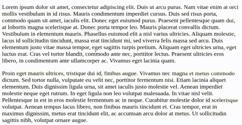

# slidev-component-spotlight

[](https://www.npmjs.com/package/slidev-component-spotlight)

Key activable spotlight for `Slidev`.



Hold <kbd>Shift</kbd> to activate the spotlight (can be customized).

Also works in presenter mode.

## Installation

```bash
npm i slidev-component-spotlight
```

## Configuration

Define this package into your slidev addons.

In your slides metadata (using frontmatter):
```
---
addons:
  - slidev-component-spotlight
---
```

Or in your `package.json`:
```json
{
  "slidev": {
    "addons": [
      "slidev-component-spotlight"
    ]
  }
}
```

## Usage

Create a `./global-top.vue` file in your `Slidev` project and use the component:
```vue
<template>
  <SlidevSpotlight/>
</template>
```

## Components

### SlidevSpotlight

Component that displays the pager:
```vue
<SlidevSpotlight/>
```

Parameters:

* `activationKey` (type: `string`, default: `'Shift'`): The key to hold down to activate the spotlight
* `color` (type: `string`, default: `'black'`): CSS color of the spotlight shadow
* `opacity` (type: `number | string`, default: `0.75`): Opacity of the spotlight shadow
* `size` (type: `string`, default: `100px`): Size of the spotlight
* `transitionDuration` (type: `string`, default: `200ms`): CSS transition durations
